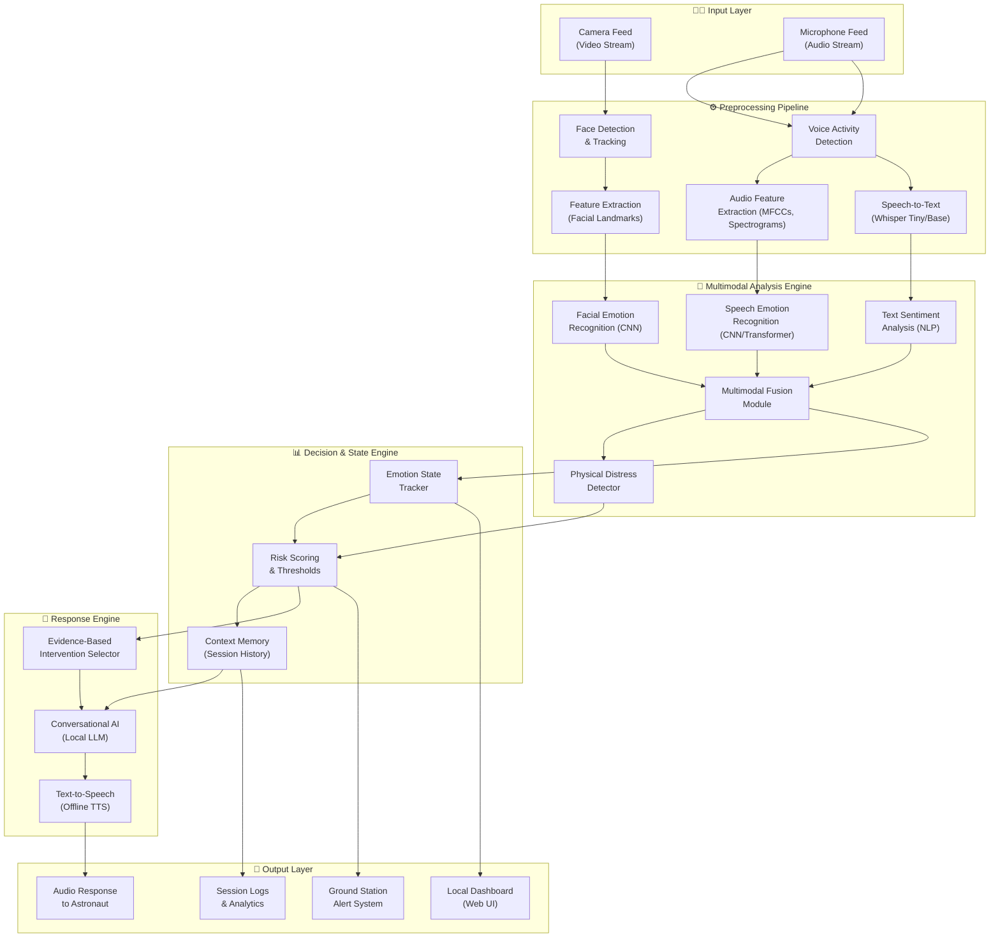
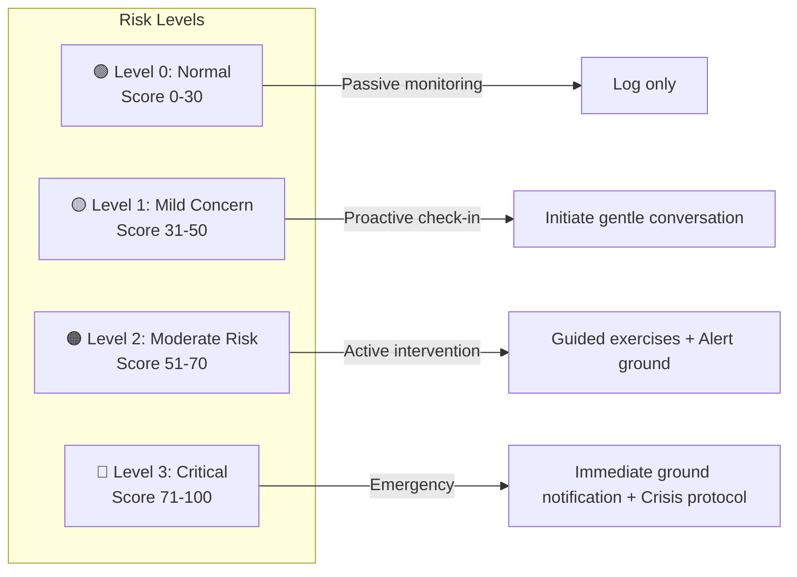
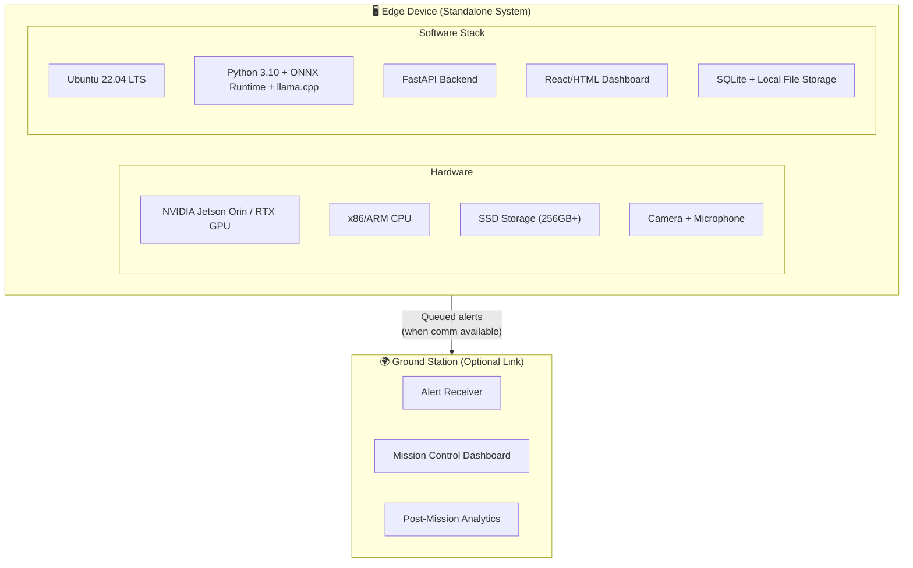
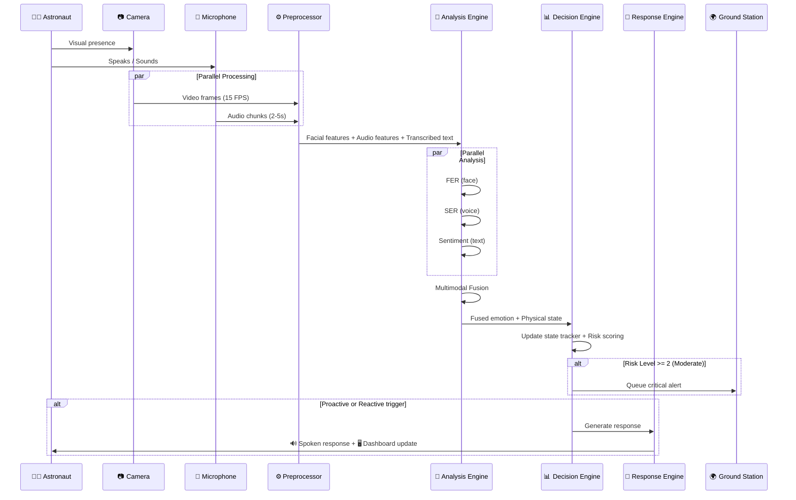
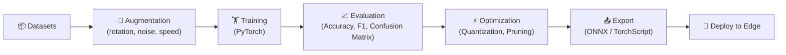

# MAITRI — Architecture & Implementation Plan
### Multimodal AI Assistant for Psychological & Physical Well-Being of Astronauts
> **SIH 2025 · Problem ID 25175 · ISRO / Department of Space · Hard**

---

## 1. Problem Summary

Astronauts aboard the **Bhartiya Antariksh Station (BAS)** face isolation, sleep disruption, tight schedules, and physical discomforts — all of which can trigger serious psychological and physical issues. **MAITRI** is a **standalone, offline, multimodal AI assistant** that:

1. **Detects** emotions via facial expressions + voice tone (audio-video)
2. **Provides** short adaptive conversations, psychological companionship & evidence-based interventions
3. **Reports** critical emotional/physical states to ground control

> [!IMPORTANT]
> **Key Constraint**: The deliverable must be a **trained AI model running on a standalone offline system** (edge computing). No cloud dependency in production.

---

## 2. High-Level Architecture



---

## 3. Module-by-Module Breakdown

### 3.1 Input Layer

| Component | Purpose | Technology |
|-----------|---------|------------|
| **Camera Feed** | Continuous video capture of astronaut's face | OpenCV VideoCapture, USB/IP Camera |
| **Microphone Feed** | Continuous audio capture of astronaut's voice | PyAudio / sounddevice |

> [!NOTE]
> Feeds are processed in real-time with frame-level and chunk-level buffering. Video at ~15 FPS (sufficient for FER), audio at 16kHz mono.

---

### 3.2 Preprocessing Pipeline

| Component | What it does | Model / Library |
|-----------|-------------|-----------------|
| **Face Detection & Tracking** | Locates and tracks face across frames | MediaPipe Face Mesh / MTCNN / RetinaFace |
| **Facial Landmark Extraction** | Extracts 468 landmarks for AU detection | MediaPipe / dlib 68-point |
| **Voice Activity Detection** | Filters silence, isolates speech segments | Silero VAD (lightweight, offline) |
| **Audio Feature Extraction** | Extracts MFCCs, Mel-spectrograms, pitch, energy | Librosa / torchaudio |
| **Speech-to-Text** | Transcribes speech for NLP analysis | OpenAI Whisper (tiny/base — runs offline) |

---

### 3.3 Multimodal Analysis Engine (Core AI)

This is the heart of MAITRI — three parallel emotion recognition streams fused into a unified emotional state.

#### 3.3.1 Facial Emotion Recognition (FER)

```
Input: Cropped face frames (48x48 or 224x224)
Model: Fine-tuned MobileNetV2 / EfficientNet-Lite / Custom CNN
Output: Probabilities over 7 emotions 
        [Happy, Sad, Angry, Fear, Surprise, Disgust, Neutral]
Dataset: FER2013, AffectNet, RAF-DB
```

#### 3.3.2 Speech Emotion Recognition (SER)

```
Input: Mel-spectrograms / MFCC features from audio chunks (2-5s)
Model: CNN-LSTM hybrid / HuBERT-tiny fine-tuned
Output: Probabilities over emotions 
        [Happy, Sad, Angry, Fear, Neutral, Stressed, Fatigued]
Dataset: RAVDESS, CREMA-D, IEMOCAP, EMO-DB
```

#### 3.3.3 Text Sentiment Analysis

```
Input: Transcribed text from Whisper STT
Model: DistilBERT / TinyBERT fine-tuned for sentiment + emotion
Output: Sentiment (Positive/Negative/Neutral) + Emotion labels
Dataset: GoEmotions, EmoInt, custom astronaut dialogue corpus
```

#### 3.3.4 Multimodal Fusion Module

```
Strategy: Late Fusion with Attention-weighted aggregation

Fusion Formula:
  E_final = α·E_face + β·E_voice + γ·E_text
  
  Where α, β, γ are learned attention weights 
  (or confidence-weighted based on input quality)

Conflict Resolution:
  - If face says "happy" but voice says "stressed" → 
    voice gets higher weight (harder to mask)
  - Missing modality graceful degradation 
    (e.g., face not visible → rely on audio+text)
```

#### 3.3.5 Physical Distress Detector

| Signal | Detection Method |
|--------|-----------------|
| **Fatigue** | Yawning detection (mouth aspect ratio), eye blink rate, droopy eyelids |
| **Pain/Discomfort** | Facial Action Units (AU4, AU6, AU7, AU9, AU10, AU43) |
| **Sleep Deprivation** | Microsleep detection (prolonged eye closure), response latency |
| **Stress** | Voice jitter, pitch variability, speech rate changes |

---

### 3.4 Decision & State Engine

#### 3.4.1 Emotion State Tracker

Maintains a **rolling temporal profile** of the astronaut's emotional state:

```
EmotionState:
  current_emotion: "stressed"
  confidence: 0.82
  duration_in_state: "00:14:32"
  trend: "worsening"        # stable / improving / worsening
  history: [last 24h rolling window]
  baseline: {personal average emotional profile}
```

#### 3.4.2 Risk Scoring & Thresholds



**Risk Score Formula:**
```
risk_score = w1 * emotion_severity 
           + w2 * duration_factor 
           + w3 * trend_factor 
           + w4 * physical_distress_score
           + w5 * context_modifier (time of day, mission phase, etc.)
```

#### 3.4.3 Context Memory

- **Short-term**: Current conversation session (what was discussed, astronaut's responses)
- **Long-term**: SQLite database with historical emotion logs, intervention history, personal preferences
- **Astronaut Profile**: Baseline mood patterns, known triggers, preferred coping strategies

---

### 3.5 Response Engine

#### 3.5.1 Conversational AI (Local LLM)

| Option | Model Size | Suitability |
|--------|-----------|-------------|
| **Phi-3 Mini (3.8B)** | ~2.5 GB quantized | Best balance of quality + edge performance |
| **Gemma 2B** | ~1.5 GB quantized | Lighter alternative |
| **Llama 3.2 3B** | ~2 GB quantized | Strong general capability |
| **TinyLlama 1.1B** | ~700 MB quantized | Ultra-lightweight fallback |

**Inference Runtime**: llama.cpp / ONNX Runtime / TensorRT (GPU-accelerated)

**System Prompt Strategy**:
```
You are MAITRI, a compassionate AI companion for astronauts aboard 
the Bhartiya Antariksh Station. Your role is to:
- Provide warm, empathetic psychological support
- Keep conversations short and situation-relevant
- Use evidence-based therapeutic techniques (CBT, mindfulness, etc.)
- Never diagnose — support and escalate when needed
- Be culturally sensitive and adapt to the astronaut's preferences

Current astronaut emotional state: {emotion_state}
Risk level: {risk_level}
Suggested intervention: {intervention_type}
Conversation history: {recent_context}
```

#### 3.5.2 Evidence-Based Intervention Selector

Maps risk levels and emotional states to therapeutic interventions:

| Emotion State | Intervention Type | Example |
|---------------|------------------|---------|
| Anxious / Stressed | Breathing exercises, grounding techniques | "Let's try box breathing — inhale for 4..." |
| Sad / Lonely | Empathetic listening, positive reminiscence | "Would you like to talk about what's on your mind?" |
| Angry / Frustrated | De-escalation, cognitive reframing | "That sounds frustrating. Let's break it down..." |
| Fatigued | Sleep hygiene tips, micro-rest guidance | "A 10-minute power nap could help. Shall I set a timer?" |
| Normal (proactive) | Casual check-in, mission encouragement | "How's the experiment going? You're doing great work." |

> [!TIP]
> Interventions are stored in a structured JSON knowledge base with tags, so the system can retrieve contextually relevant responses without internet.

#### 3.5.3 Text-to-Speech (Offline)

| Option | Notes |
|--------|-------|
| **Piper TTS** | Fast, offline, multiple voices, ONNX-based |
| **Coqui TTS** | Higher quality, slightly heavier |
| **eSpeak-NG** | Ultra-lightweight fallback |

---

### 3.6 Output Layer

| Component | Description |
|-----------|-------------|
| **Audio Response** | Spoken response to astronaut via speakers |
| **Local Dashboard** | Web-based UI showing emotion trends, session history, risk levels |
| **Ground Station Alerts** | Structured JSON alerts queued for transmission (when comm window available) |
| **Session Logs** | Encrypted local storage of all interactions for analysis |

---

## 4. System Architecture — Deployment View



### Hardware Requirements (Edge Deployment)

| Component | Minimum | Recommended |
|-----------|---------|-------------|
| **GPU** | NVIDIA Jetson Orin Nano (8GB) | NVIDIA Jetson AGX Orin (32GB) |
| **CPU** | ARM Cortex-A78AE / Intel i5 | ARM Cortex-A78AE 12-core / Intel i7 |
| **RAM** | 16 GB | 32 GB |
| **Storage** | 128 GB SSD | 256 GB SSD |
| **Camera** | 720p USB camera | 1080p with IR for low-light |
| **Microphone** | USB microphone | Noise-cancelling array mic |

---

## 5. Data Pipeline & Processing Flow



---

## 6. Project Structure (Proposed)

```
MAITRI/
├── 📁 data/
│   ├── datasets/              # Training datasets (FER2013, RAVDESS, etc.)
│   ├── interventions/         # JSON knowledge base of interventions
│   └── profiles/              # Astronaut baseline profiles
│
├── 📁 models/
│   ├── fer/                   # Facial Emotion Recognition model
│   ├── ser/                   # Speech Emotion Recognition model
│   ├── sentiment/             # Text sentiment model
│   ├── whisper/               # Whisper STT model weights
│   ├── llm/                   # Local LLM weights (quantized)
│   └── tts/                   # TTS model weights
│
├── 📁 src/
│   ├── 📁 input/
│   │   ├── camera.py          # Video capture & frame buffering
│   │   └── microphone.py      # Audio capture & chunking
│   │
│   ├── 📁 preprocessing/
│   │   ├── face_detector.py   # Face detection & landmark extraction
│   │   ├── audio_processor.py # VAD, MFCC, spectrogram extraction
│   │   └── transcriber.py     # Whisper STT wrapper
│   │
│   ├── 📁 analysis/
│   │   ├── fer_model.py       # Facial emotion recognition
│   │   ├── ser_model.py       # Speech emotion recognition
│   │   ├── sentiment.py       # Text sentiment analysis
│   │   ├── fusion.py          # Multimodal fusion module
│   │   └── physical.py        # Physical distress detection
│   │
│   ├── 📁 decision/
│   │   ├── state_tracker.py   # Emotion state management
│   │   ├── risk_scorer.py     # Risk level computation
│   │   └── context_memory.py  # Session & long-term memory
│   │
│   ├── 📁 response/
│   │   ├── conversation.py    # LLM conversation manager
│   │   ├── interventions.py   # Evidence-based intervention selector
│   │   └── tts_engine.py      # Text-to-speech wrapper
│   │
│   ├── 📁 output/
│   │   ├── dashboard.py       # Local web dashboard (FastAPI)
│   │   ├── ground_alert.py    # Ground station alert queue
│   │   └── logger.py          # Session logging & analytics
│   │
│   ├── pipeline.py            # Main orchestration pipeline
│   └── config.py              # Configuration & constants
│
├── 📁 frontend/
│   ├── index.html             # Dashboard UI
│   ├── styles.css             # Dashboard styling
│   └── app.js                 # Dashboard logic (charts, real-time updates)
│
├── 📁 tests/
│   ├── test_fer.py
│   ├── test_ser.py
│   ├── test_fusion.py
│   └── test_pipeline.py
│
├── 📁 scripts/
│   ├── train_fer.py           # Training script for FER model
│   ├── train_ser.py           # Training script for SER model
│   ├── evaluate.py            # Model evaluation & metrics
│   └── export_onnx.py         # Export models to ONNX for edge
│
├── requirements.txt
├── Dockerfile                 # Containerized deployment
├── docker-compose.yml
└── README.md
```

---

## 7. Tech Stack Summary

| Layer | Technology | Justification |
|-------|-----------|---------------|
| **Language** | Python 3.10+ | Best ML/AI ecosystem |
| **Video Processing** | OpenCV, MediaPipe | Lightweight, real-time capable |
| **Audio Processing** | Librosa, torchaudio, Silero VAD | Industry standard, offline |
| **STT** | Whisper (tiny/base) | State-of-the-art, runs offline |
| **FER Model** | MobileNetV2 / EfficientNet-Lite | Lightweight for edge, good accuracy |
| **SER Model** | CNN-LSTM / HuBERT-tiny | Proven on emotion datasets |
| **Sentiment** | DistilBERT / TinyBERT | Small footprint, fast inference |
| **Multimodal Fusion** | Custom attention-weighted fusion | Handles missing modalities gracefully |
| **Local LLM** | Phi-3 Mini (3.8B, Q4 quantized) | Best quality-to-size ratio for edge |
| **LLM Runtime** | llama.cpp / ONNX Runtime | Optimized for CPU+GPU inference |
| **TTS** | Piper TTS | Fast, offline, natural voice |
| **Backend** | FastAPI | Async, lightweight, WebSocket support |
| **Frontend** | HTML/CSS/JS + Chart.js | Simple, no build step needed |
| **Database** | SQLite | Zero-config, embedded, reliable |
| **Deployment** | Docker + Systemd | Reproducible, auto-restart |
| **Model Format** | ONNX / GGUF (LLM) | Cross-platform, optimized inference |

---

## 8. Training Strategy

### 8.1 Datasets

| Task | Dataset | Size | Notes |
|------|---------|------|-------|
| **FER** | FER2013 | 35K images | Baseline |
| **FER** | AffectNet | 450K images | Larger, higher quality |
| **FER** | RAF-DB | 30K images | Real-world, diverse |
| **SER** | RAVDESS | 7,356 clips | Clean, acted |
| **SER** | CREMA-D | 7,442 clips | Diverse demographics |
| **SER** | IEMOCAP | 12 hrs | Conversational, natural |
| **Sentiment** | GoEmotions | 58K texts | 27 emotion categories |
| **Physical** | YawDD | 322 videos | Yawning/drowsiness |
| **STT** | Built-in Whisper | — | Pre-trained, no additional training |

### 8.2 Training Pipeline



---

## 9. Interaction Modes

### 9.1 Passive Monitoring (Always On)
- Camera + microphone continuously capture
- Emotion analysis runs in background
- Dashboard updates in real-time
- No astronaut interaction required

### 9.2 Proactive Check-in (System Initiated)
- Triggered when risk score crosses threshold
- Or at scheduled intervals (e.g., every 4 hours)
- MAITRI initiates: *"Hey, I noticed you seem a bit tense. Want to take a quick break together?"*

### 9.3 Reactive Support (Astronaut Initiated)
- Astronaut says *"MAITRI"* (wake word) or presses button
- Full conversational mode activated
- *"MAITRI, I'm feeling really isolated today."*

### 9.4 Crisis Mode (Emergency)
- Triggered at Risk Level 3
- Immediate ground station alert
- Crisis de-escalation protocol activated
- Continuous monitoring until state improves

---

## 10. Ground Station Alert Format

```json
{
  "alert_id": "MAITRI-2025-08-28-001",
  "timestamp": "2025-08-28T14:32:00Z",
  "astronaut_id": "CREW-01",
  "risk_level": 3,
  "risk_score": 78,
  "emotional_state": {
    "primary": "distressed",
    "secondary": "anxious",
    "confidence": 0.85,
    "duration_minutes": 45,
    "trend": "worsening"
  },
  "physical_state": {
    "fatigue_level": "high",
    "sleep_quality_24h": "poor",
    "pain_indicators": false
  },
  "intervention_attempted": {
    "type": "breathing_exercise",
    "response": "partially_engaged",
    "effectiveness": 0.3
  },
  "recommended_action": "Schedule counseling session with ground psychologist",
  "session_log_ref": "session_2025-08-28_14.log"
}
```

---

## 11. Key Differentiators (What Makes This Stand Out)

| Feature | Why It Matters |
|---------|---------------|
| **Multimodal Fusion with graceful degradation** | Works even if camera is blocked or mic is noisy |
| **Temporal emotion tracking** | Detects prolonged states, not just snapshots |
| **Evidence-based interventions** | Not just chatting — uses CBT, mindfulness, grounding techniques |
| **Fully offline** | Zero latency, works in space with no connectivity |
| **Astronaut personalization** | Learns individual baselines and preferences over time |
| **Physical + Psychological** | Detects fatigue, pain, sleep issues — not just emotions |
| **4-tier risk escalation** | Proportional response from passive to emergency |
| **Ground station integration** | Structured alerts for mission control psychologists |

---

## 12. Development Phases (Hackathon Timeline)

### Phase 1: Foundation (Day 1 — First Half)
- [ ] Set up project structure & environment
- [ ] Implement camera + microphone input capture
- [ ] Face detection + landmark extraction pipeline
- [ ] Audio preprocessing (VAD, MFCC extraction)

### Phase 2: Core AI Models (Day 1 — Second Half)
- [ ] Train/fine-tune FER model on FER2013/AffectNet
- [ ] Train/fine-tune SER model on RAVDESS/CREMA-D
- [ ] Integrate Whisper for STT
- [ ] Implement text sentiment analysis

### Phase 3: Fusion & Decision (Day 2 — First Half)
- [ ] Build multimodal fusion module
- [ ] Implement emotion state tracker
- [ ] Build risk scoring system
- [ ] Physical distress detection (fatigue, yawning)

### Phase 4: Response & Conversation (Day 2 — Second Half)
- [ ] Set up local LLM (Phi-3 Mini quantized)
- [ ] Build intervention knowledge base
- [ ] Implement conversation manager with context
- [ ] Integrate Piper TTS for spoken responses

### Phase 5: Integration & UI (Day 3 — First Half)
- [ ] Build real-time dashboard (emotion trends, risk levels)
- [ ] End-to-end pipeline integration
- [ ] Ground station alert system
- [ ] Session logging

### Phase 6: Polish & Demo (Day 3 — Second Half)
- [ ] Testing & bug fixes
- [ ] Performance optimization for edge
- [ ] Demo preparation & presentation
- [ ] Documentation

---

## 13. Evaluation Metrics

| Metric | Target | Measurement |
|--------|--------|-------------|
| **FER Accuracy** | ≥ 70% on 7-class | Test set accuracy + F1 |
| **SER Accuracy** | ≥ 65% on 6-class | Test set accuracy + F1 |
| **Fusion Accuracy** | ≥ 75% combined | Cross-modal validation |
| **Response Latency** | < 3 seconds end-to-end | Time from detection to speech output |
| **False Alert Rate** | < 10% | Percentage of incorrect escalations |
| **Conversation Quality** | Subjective evaluation | Empathy, relevance, helpfulness (judge panel) |
| **System Uptime** | 99%+ continuous | Stress test over 24 hours |

---

## Open Questions

> [!IMPORTANT]
> **Q1:** What is your team's GPU availability? This affects which LLM size and inference runtime we should target (Jetson vs. desktop GPU vs. CPU-only).

> [!IMPORTANT]
> **Q2:** Do you want a **web-based dashboard** (React/plain HTML) or a **desktop GUI** (PyQt/Tkinter) for the astronaut-facing interface?

> [!IMPORTANT]
> **Q3:** For the hackathon demo, should we prioritize:
> - (a) **Real-time live demo** with webcam + mic, or
> - (b) **Pre-recorded video analysis** showing the pipeline working on test clips?

> [!NOTE]
> **Q4:** Do you have any preference on the local LLM? (Phi-3 Mini is recommended for quality-to-size ratio, but Gemma 2B is lighter if GPU is constrained)

> [!NOTE]
> **Q5:** Should the wake-word detection ("MAITRI") be included, or is a push-to-talk button sufficient for the demo?
